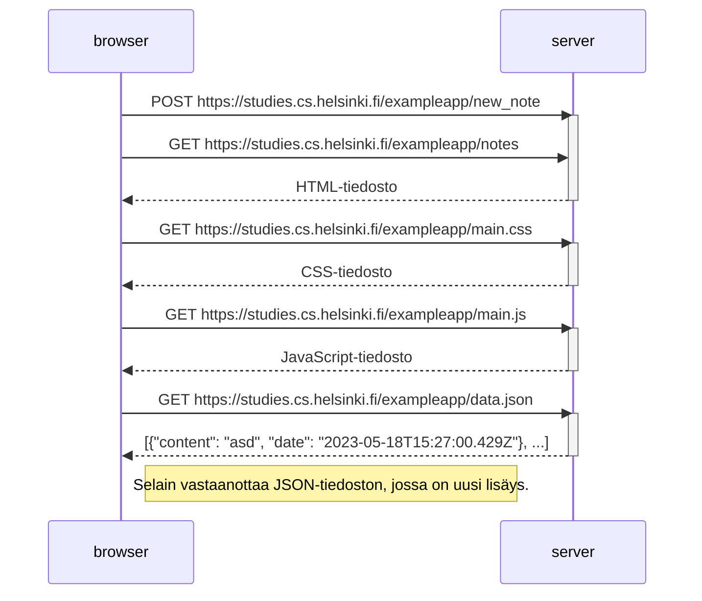

```mermaid
sequenceDiagram
	participant browser
	participant server

	browser->>server: POST https://studies.cs.helsinki.fi/exampleapp/new_note
	activate server
	browser->>server: GET https://studies.cs.helsinki.fi/exampleapp/notes
	server-->>browser: HTML-tiedosto
	deactivate server

	browser->>server: GET https://studies.cs.helsinki.fi/exampleapp/main.css
	activate server
	server-->>browser: CSS-tiedosto
	deactivate server

	browser->>server: GET https://studies.cs.helsinki.fi/exampleapp/main.js
	activate server
	server-->>browser: JavaScript-tiedosto
	deactivate server

	browser->>server: GET https://studies.cs.helsinki.fi/exampleapp/data.json
	activate server
	server-->>browser: [{"content": "asd", "date": "2023-05-18T15:27:00.429Z"}, ...]
	deactivate server
	Note right of browser: Selain vastaanottaa JSON-tiedoston, jossa on uusi lisäys.
	
```
